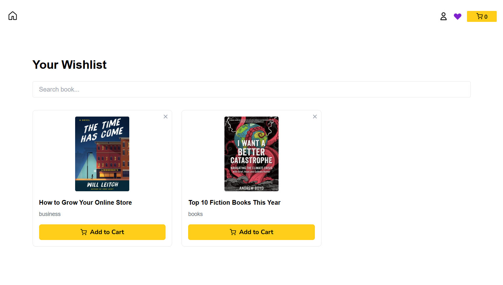
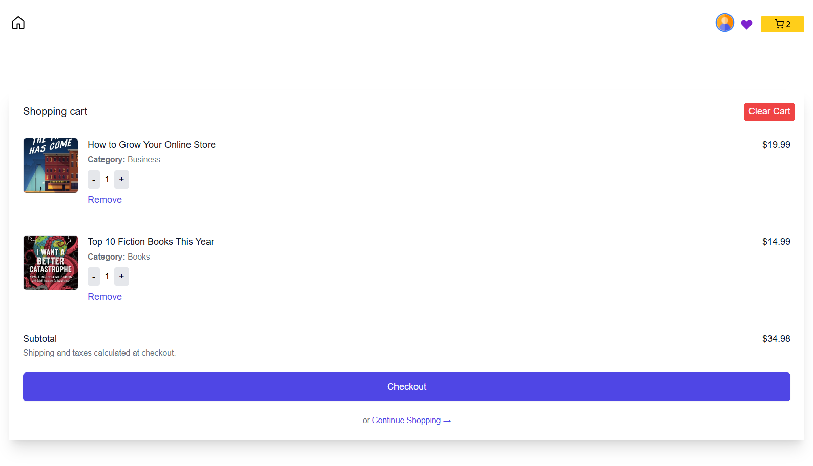
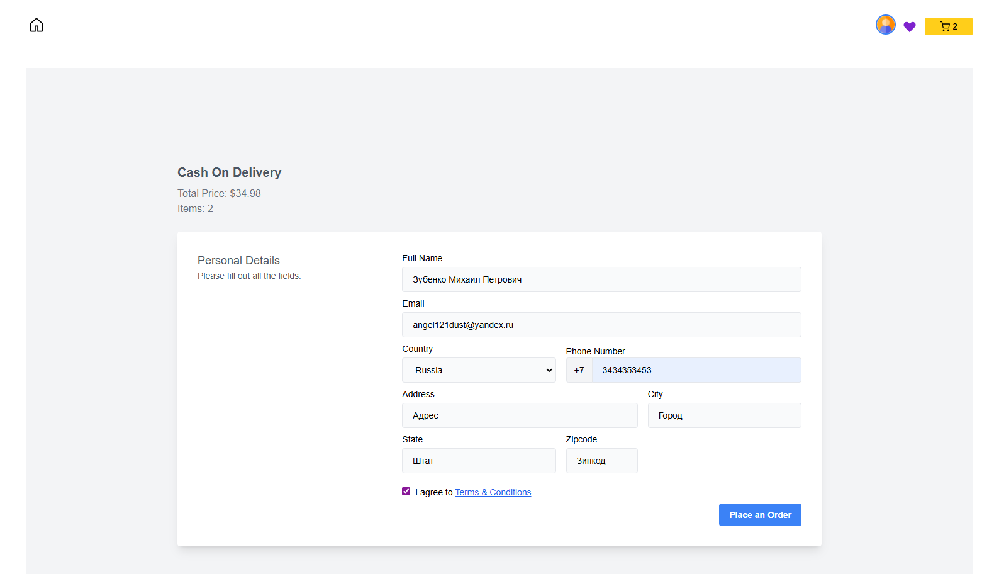
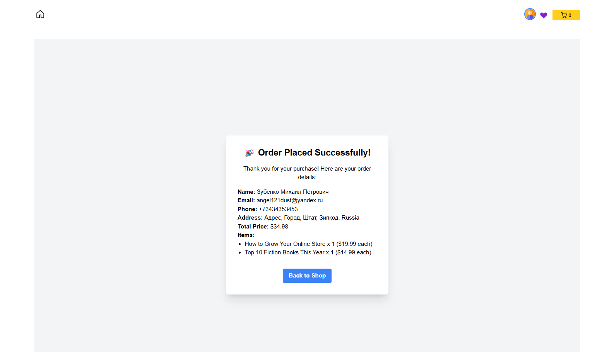
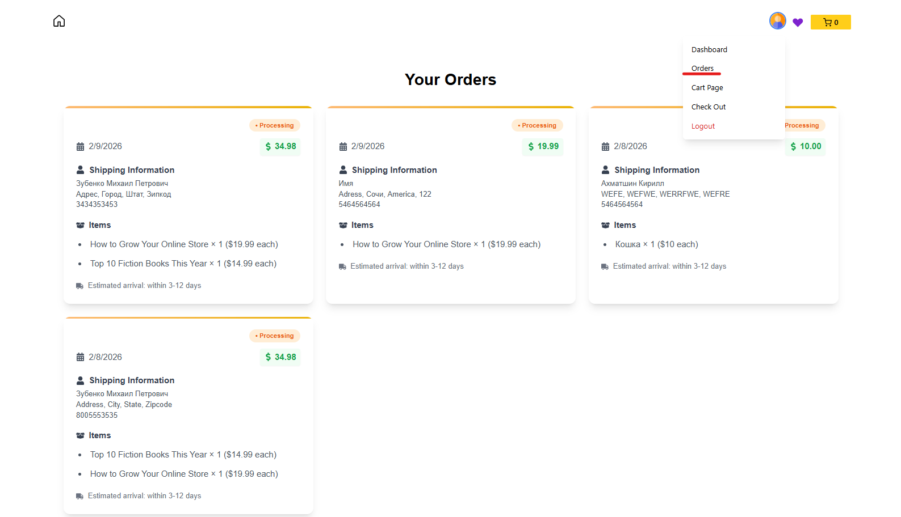
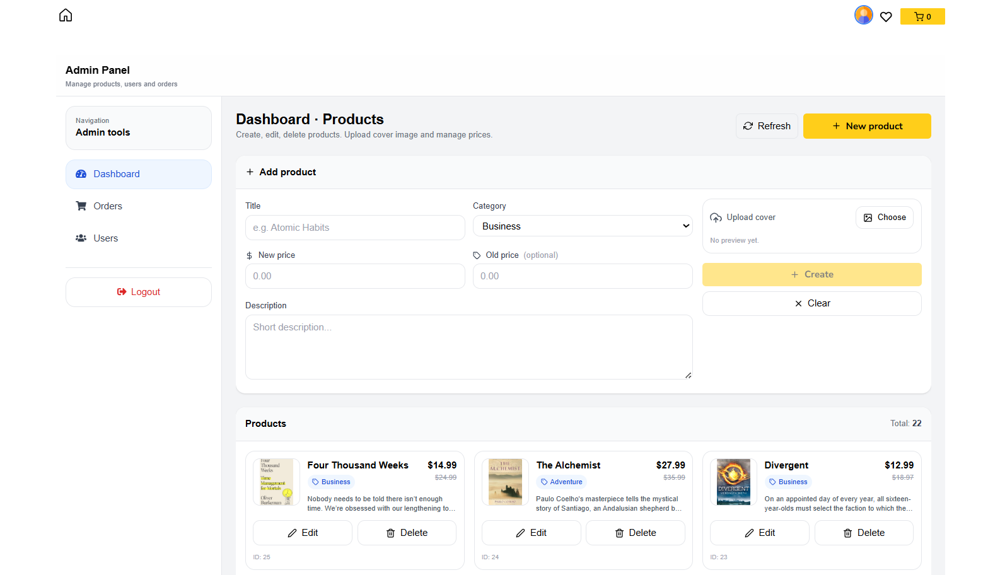

# 📚 Book Store — Fullstack Pet Project

**Book Store** — pet-проект интернет-магазина книг, созданный для демонстрации моих
навыков **Frontend-разработки (основной фокус)** и понимания **Backend-архитектуры**.

Проект реализован как полноценное SPA-приложение с авторизацией,
корзиной, заказами и административной панелью.

---

## 🎯 Цель проекта

- Продемонстрировать навыки **Frontend-разработки**
- Работа с реальным **REST API**
- Управление состоянием приложения
- Авторизация и роли пользователей
- Архитектура SPA-приложений
- Использование современного React-стека

---

## 🧩 Функциональность

### 👤 Пользователь
- Регистрация и авторизация (JWT)
- Просмотр каталога книг
- Просмотр детальной страницы книги
- Добавление книг в корзину
- Добавление в избранное
- Оформление заказа
- Просмотр истории заказов

### 🛒 Корзина
- Добавление и удаление товаров
- Изменение количества
- Подсчёт общей стоимости
- Состояние через Redux Toolkit

### 🛠 Административная панель
- Защищённый доступ (роль admin)
- Управление книгами
- Просмотр заказов
- Управление пользователями
- Загрузка изображений книг

---

## 💻 Технологии

### Frontend
- React 18
- TypeScript
- Vite
- Redux Toolkit
- RTK Query
- React Router DOM
- Tailwind CSS
- Swiper
- SweetAlert2

### Backend
- Node.js
- Express
- PostgreSQL
- JWT Authentication
- REST API
- Middleware (auth, role-based access)

---

## 🧠 Архитектура Frontend

- SPA архитектура
- Feature-based структура
- Разделение:
  - UI компонентов
  - страниц
  - бизнес-логики
  - API слоя
- Контекст авторизации + Redux
- Типизация данных
- Защищённые маршруты

---

## 🔐 Авторизация
- JWT токен
- Хранение токена
- Декодирование ролей
- Middleware на backend
- Protected routes на frontend

---

## 📷 Скриншоты

## Главная страница


## Вкладка «Избранные»



## Корзина



## Проверка (checkout)



## Интерактивное уведомление о совершении заказа



## Вкладка «Заказы»



## Панель администратора (Dashboard)




---

## 🔐 Переменные окружения (Backend)

Все чувствительные данные (ключи, пароли, конфигурация) вынесены в переменные окружения и не хранятся в репозитории.

Для запуска backend части необходимо дополнить файл `.env` в папке `backend`
на основе `.env.example` и указать следующие параметры:

- `PORT` — порт backend сервера
- `PGHOST` — хост PostgreSQL
- `PGPORT` — порт PostgreSQL
- `PGUSER` — пользователь БД
- `PGPASSWORD` — пароль пользователя БД
- `PGDATABASE` — имя базы данных
- `JWT_SECRET` — секретная строка для подписи JWT-токенов (может быть любым значением; при изменении секрета ранее выданные токены становятся недействительными)

---

## 🗄️ Инициализация базы данных (PostgreSQL)

Проект использует **PostgreSQL** в качестве базы данных.

В репозитории присутствует SQL-файл:

- `backend/db/schema+data.sql` — содержит структуру таблиц и тестовые данные

Файл позволяет развернуть полностью готовую базу данных для локального запуска проекта.

### Тестовый доступ администратора

> В тестовых данных предусмотрен пользователь с ролью **admin**, используемый исключительно для демонстрации функциональности административной панели.  
> (используется исключительно для демонстрации функциональности):
> - логин: `kirill@gmail.com`
> - пароль: `1234`

### Шаги для инициализации базы данных

1. Создать базу данных:
CREATE DATABASE book_store;


2. Применить SQL-скрипт с структурой и тестовыми данными:

Вариант 1 (рекомендуется, через pgAdmin):
- Открыть pgAdmin
- Подключиться к серверу PostgreSQL
- Выбрать базу данных book_store
- Открыть Query Tool
- Выполнить файл schema+data.sql

Вариант 2 (через CLI):
```bash
psql -d book_store -f backend/db/schema+data.sql
```
После выполнения скрипта база данных будет полностью готова к использованию.

---

## 🚀 Запуск проекта

```bash
# Запуск frontend части (SPA на Vite)
cd frontend
npm install
npm run dev

# Запуск backend части (REST API)
cd backend
npm install
npm run dev

